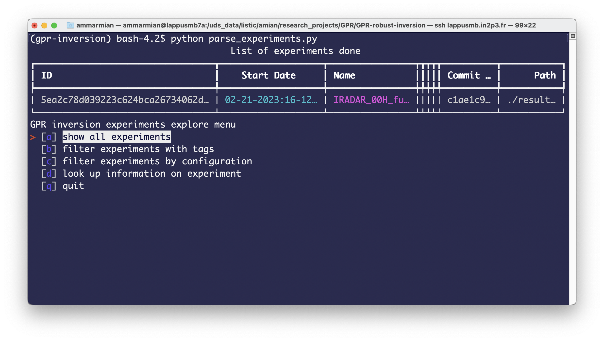
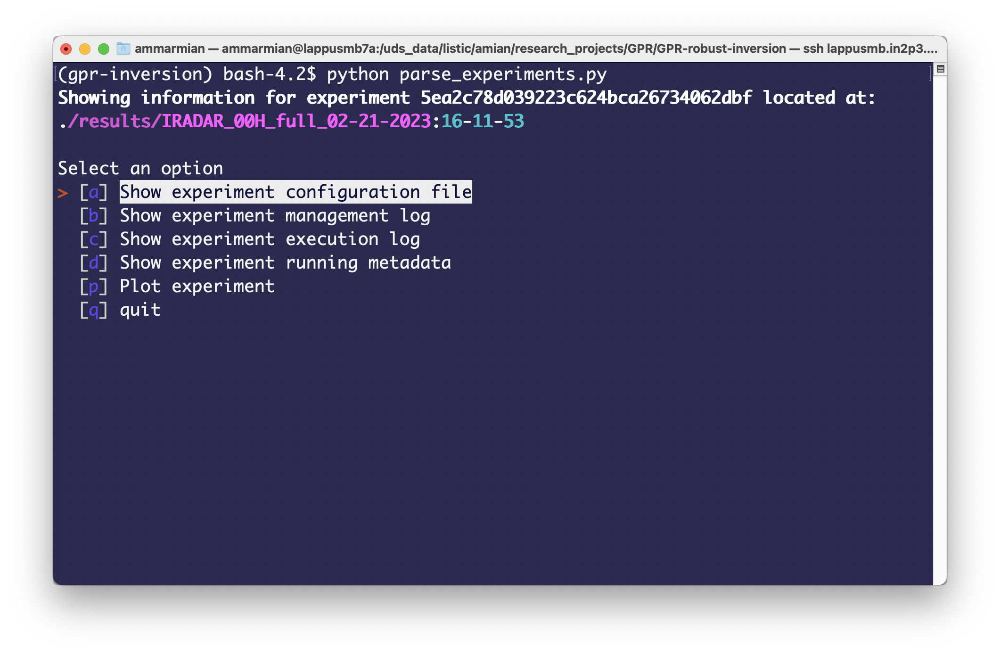

<a name="readme-top"></a>
# GPR-robust-inversion

Package of robust GPR inversion using Huber norm and source separation. This repository contains reproducible code for a submitted TGRS paper "New Robust Sparse Convolutional Coding Inversion Algorithm for Ground Penetrating Radar Images".

<details>
  <summary>Table of Contents</summary>
  <ol>
    <li>
      <a href="#gpr-robust-inversion">About The Project</a>
    </li>
    <li><a href="#documentation">Documentation</a></li>
    <li>
      <a href="#running-the-code">Running the code</a>
      <ul>
        <li><a href="#prerequisites">Prerequisites</a></li>
        <li><a href="#repertory-organisation">Repertory organisation</a></li>
        <li><a href="#launching-an-experiment">Launching an experiment</a></li>
      </ul>
    </li>
    <li><a href="#authors">Authors</a></li>
    <li><a href="#citation">Citation</a></li>
  </ol>
</details>

## Documentation

Documentation for the main code package can be found [here](https://matthieu-gallet.github.io/GPR-robust-inversion/index.html).

## Data

An example image is provided in the **data/** directory. Untar it before proceeding:
```bash
tar -tvf data/IRADAr__00H.tar.gz
```

## Running the code

### Prerequisites

The code is provided in a running environment based upon YAML experiment files. To handle this on your machine, the best way is to isntall the conda environment provided in the file **environment.yml**:

```bash
conda create -f environment.yml
```

and then activate the environment through:
```bash
conda activate gpr-inverion
```

To install conda, see: https://docs.conda.io/en/latest/

> :heavy_exclamation_mark: The code works only in the framework of a git repertory for reproducibility purposes. It is important to keep the **.git/** sub-repertory when downloading the code.


### Repertory organisation

The repo is organised as follows:

```ascii
├── .git
├── data
├── docs
├── experiments
│   └── estimators
├── MIRAG
│   ├── dictionary
│   └── optim
└── results
```

The main package is located in **MIRAG/** directory, which can be copied in any of your projets if needing to use the tools developed here. A documentation is available in **docs/** directory. An example image provided by Geolithe (which we thanks for) is available in **data/**. Finally experiments YAML files are stored in **experiments/** and **results/** is the default directory where the results of an experiment are sotred.

### Launching an experiment


In order to have a repoducible framework, this repertory works on the principle of single experiments:
>An experiment here is defined as a run of several inversion algorithms on a given GPR image while sharing the same atoms dictionary. For each algorithm, the hyperparameters are precised and do not vary (although it is possible to define several time the same inversion algorithm with different hyperparameters).

An experiment is defined by its YAML file in the **experiments/** directory. Several of such files reproducing partially the results presented in the paper are given:
* **IRADAR_00H_full.yml** produces experiment for Fig. 7 and 8. (d) of the paper
* **IRADAR_00H_Huber_variation_sparsity.yml** produces experiment of Fig. 9. (d) of the paper

**When wanting to change parameters, it's better to copy those files and change the name and tags to keep in memory the parameters for the paper.**

In those files, the dataset is precised as well as tags for the experiment (which can be custom). Then inversion algorithms are precised in the **methodologies** keys, where we specify the algorithm definition file (in the **./experiments/estimators** directory). An algorithm definition file create a variable estimator referencing a scikit-learn compatible class implementing a fit method. This class will then be parsed by the execution to perform the inversion. Additionally, the method's hyperparameters are attributes of the estimator class and are specified in the **hyperparameters** key of the corresponding method. See examples files for a better understanding.

> :heavy_exclamation_mark: Before launching an experiment, we check if the repertory is not dirty (uncomitted changes) otherwhise, the code will refuse to execute. This is mainly because the commit sha is saved for each experiment to be able to track back to the verion of the code used when launching the experiment.
> The **experiments/** folder is obviously excluded from this rule as we expect to change it extensively in tests

Once an experiment is defined, we can launch the experiment thanks to **launch_experiment.py** file which is a wrapper around the **execute_experiment.py** which actually defines what an experiment is in this context (reading data, constructing dictionary, performing inversion for all inversion methodologies and saving those results in pickle artifact). For example:

```bash
python launch_experiment.py experiments/IRADAR_00H_full.yml
```

This action will create a custom directory in the **results/** directory corresponding to the experiment where the name is a combination of the experiment name oin the YAML description and the date of execution. Then it will launch **execute_experiment.py** with the good paths. There is no output on the terminal as logs files are generated in the experiment directory:
* **experiment_management.log**: logs related to the management of the experiemnt (creating the results directory, launching the experiment and saving results)
* **experiment_execution.log**: logs related to the actual execution (dictionary creation, launch of inversion algorithms and saving artifacts of results)

Other options are also available (see: `python launch_experiment.py --help`) for running through an HTCondor job management system.

> :warning: By default, the execution use parallel processing in order to save time (one thread per inversion algorithm), which also means that the image is replicated as many times as algorithms in the memory which can exceed the amount of RAM available. It is possible to deactivate this by replacing `n_jobs=-1` to `n_jobs=1`in the file **execute_experiment.py** at line 180. And of course, there is a need to commit this change in the git repertory.

When one or more experiments are done, it is possible to see a summary of all experiments done thansk to the command:
```bash
python parse_experiement.py
```
which yields a prompt similar to this:


which allows to look up infromation and compare experiments as well as plot an experiment when using the option **look up information on experiment**:


> :warning: Unfortunately, this command is not compatible with Windows command shell, so to plot, we can use the script **plot_experiment.py**. For example:
> ```bash
> python plot_experiment results/IRADAR_00H_full_02-21-2023:16-11-53/
> ```

<p align="right">(<a href="#readme-top">back to top</a>)</p>

## Authors

Code developed by:
* Matthieu Gallet, Ph.d student at LISTIC, Université Savoie Mont-Blanc.  
  * contribution: main code for inversion and creation of physical dictionary
  * :envelope: mail: matthieu.gallet@protonmail.com
  * :house: web: https://matthieu-gallet.github.io
* Ammar Mian, Associate professor at LISTIC, Université Savoie Mont-Blanc
  * contribution: reproducible experiments wrapping of the paper
  * :envelope: mail: ammar.mian@univ-smb.fr
  * :house: web: https://ammarmian.github.io

Paper contributors: Guillaume Ginolhac, Esa Ollila and Nickolas Stelzenmuller.

Data provided by [Geolithe](http://geolithe.fr).

<p align="right">(<a href="#readme-top">back to top</a>)</p>

## Citation
```Latex
@inproceedings{	gallet:hal-03726282,
  TITLE = {{Nouvel algorithme d'inversion robuste pour le RADAR GPR}},
  AUTHOR = {Gallet, Matthieu and Mian, Ammar and Ginolhac, Guillaume and Stelzenmuller, Nickolas},
  URL = {https://hal.archives-ouvertes.fr/hal-03726282}, 
  BOOKTITLE = {{GRETSI, XXVIII{\`e}me Colloque Francophone de Traitement du Signal et des Images}}
  YEAR = {2022}, 
  MONTH = Sep,
  HAL_ID = {hal-03726282},
  HAL_VERSION = {v1},
}
```
<p align="right">(<a href="#readme-top">back to top</a>)</p>
